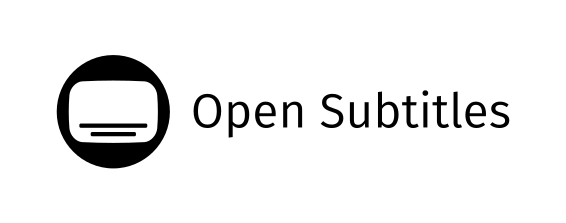

<p align="center">
  
</p>

<p align="center">
  <b>The shared engine behind the OwnTV apps</b><br>
  <sub>Data · sync · parsers · EPG · playback — everything that isn't a screen</sub>
</p>

<p align="center">
  
  
  
  
  
  
  <a href="https://hosted.weblate.org/engage/owntv/">
    
  </a>
</p>

<p align="center">
  <a href="https://github.com/ahXN00/OwnTV_Core/actions/workflows/build.yml">
    
  </a>
  <a href="https://github.com/ahXN00/OwnTV_Core/actions/workflows/i18n.yml">
    
  </a>
  <a href="https://github.com/ahXN00/OwnTV_Core/actions/workflows/publish.yml">
    
  </a>
</p>

---

OwnTV Core is the **headless half** of [OwnTV](https://github.com/ahXN00/OwnTV), the open-source
IPTV **player** for Android TV. Everything that is not a screen lives here: the Room database and
every migration, playlist sync and parsing for **M3U / Xtream / Stalker**, EPG, backup and restore,
profiles, downloads, settings storage, **every user-visible string**, and the **dual playback
engine** — libmpv (FFmpeg) plus Media3/ExoPlayer.

Neither module renders anything. They use the Compose **runtime** for state, but no `compose-ui`,
no `compose-foundation`, no `androidx.tv.*` and no navigation — that is exactly what lets one engine
back both the Android TV app and the phone/tablet app.

> ⚠️ OwnTV provides **no** channels, playlists, subscriptions, streams or media content. This is
> library code for building a player; the sources are the user's own.

---

## 💬 Community

Questions, ideas, bug reports — or just want to follow along? **Join the OwnTV Telegram group:**

### 👉 [t.me/owntvplayer](https://t.me/owntvplayer)

Scan to join from your phone:

<a href="https://t.me/owntvplayer"></a>

---

## 📦 The two modules

Published together, always on one version — two artifacts that must be used as a pair should not
have numbers that can disagree.

| Module | Namespace | What it is |
|---|---|---|
| **`:core`** | `tv.own.owntv.core` | Room database and migrations, sync, parsers, EPG, backup, profiles, downloads, settings, metadata, and every string. |
| **`:player-core`** | `tv.own.owntv.playercore` | The playback engine — libmpv plus the Media3/ExoPlayer handoff, the fallback ladder, watchdogs and stream diagnostics. Depends on `:core`. |

## ✨ What's inside

### 🎬 Playback (`:player-core`)
- **Dual engine** — libmpv (FFmpeg) for maximum codec compatibility, ExoPlayer (Media3) for
  near-instant Live TV, with an automatic fallback ladder between them
- **Watchdogs that assume the stream is hostile** — no-frame detection, stall recovery, surface
  resets, reconnect logic, and a live diagnostics log
- Zero-copy **4K HDR** direct rendering, frame-rate matching, throughput tracking, resolution and
  codec reporting, volume boost, subtitle shift and language selection
- Live timeline geometry for catch-up/rewind, hero and preview engines for browse screens

### 🗄️ Data & sync (`:core`)
- **Room** database with the full migration chain, plus paging
- Source parsing and sync for **M3U**, **Xtream Codes** and **Stalker/Ministra (MAC portal)** —
  incremental upserts, category fallbacks, and relinking of favourites, history and progress
- **EPG** (XMLTV) ingest, catch-up, and the guide's data model
- Backup and restore, including encrypted password backup, and cross-device companion transfer
- **Local sync** — two OwnTV devices on the same Wi-Fi exchanging their data directly, with no
  account and no cloud: discovery, pairing, the merge rule (the newer of two facts wins), the
  tombstones that make a deletion survive it, and a payload the two devices seal between
  themselves without ever asking the user for a passphrase
- Profiles, downloads, settings storage, TMDB metadata and trending, weather, update checks

### 🌍 Strings & translations (`:core`)
- Six Android resource components, **24 packaged locales**, and the toolkit that guards them:
  hardcoded-literal inventory, plural/CLDR validation, number-locale checks, overflow checks

## 🧱 Tech stack

Kotlin 2.4.10 · AGP 9.3.2 · Room 2.8.4 · Media3 1.11.0 · libmpv · Koin 4.2.2 · OkHttp 5 ·
Coroutines 1.11.0 · WorkManager · DataStore · Paging 3 · KSP 2.3.11 · minSdk 26

## 🔗 Who depends on this

- **[OwnTV for Android TV](https://github.com/ahXN00/OwnTV)** — shipping.
- **OwnTV for mobile** — in progress.

**A change here affects both.** Nothing is released from here until the TV app has been rebuilt
against it. There is no such thing as a change that only affects one app.

Both apps are updated automatically. Publishing a release here opens a pull request on each of them
that moves its `owntvCore` pin and refreshes its copy of `tools/i18n/locales.json`, and each app
merges that pull request itself once it has confirmed the two files agree with this repository. No
app pins a core version by hand.

## 🛠️ Building

Requires **JDK 21** and an Android SDK. Put the SDK path in `local.properties`:

```properties
sdk.dir=C:/Path/To/Android/Sdk
```

Then:

```bash
./gradlew :core:assembleRelease :player-core:assembleRelease   # build both AARs
./gradlew :core:testDebugUnitTest :player-core:testDebugUnitTest
./gradlew build                                                # everything, including lint
```

Instrumentation tests need a device or emulator, and are **never** run against a real TV that holds
real data — installing a test APK wipes the catalog, playlists, profiles and history.

```bash
./gradlew :core:assembleDebugAndroidTest        # compiles the test APK, installs nothing
```

## 📥 Consuming core from an app

Core publishes to **GitHub Packages** as `tv.own.owntv:core` and `tv.own.owntv:player-core`:

```kotlin
implementation("tv.own.owntv:core:1.0.5")
implementation("tv.own.owntv:player-core:1.0.5")
```

GitHub's Maven registry asks who you are even for public packages, so add the repository with
credentials from a [personal access token (classic)](https://github.com/settings/tokens) carrying
only **`read:packages`**:

```kotlin
maven {
    url = uri("https://maven.pkg.github.com/ahXN00/OwnTV_Core")
    credentials {
        username = providers.gradleProperty("gpr.user").orNull
        password = providers.gradleProperty("gpr.token").orNull
    }
}
```

Keep the token in `~/.gradle/gradle.properties` — **never** in a repository.

### Local development against core's source

```properties
owntv.corePath=E:/Path/To/OwnTV_Core
```

The app's `settings.gradle.kts` picks that up and includes this repo as a **composite build**, so a
core edit shows up in the next app build with no publish step. Leave the property unset and the app
resolves the published artifact instead, which is what CI does.

### Hooks an app must supply

Core deliberately knows nothing about the app hosting it. Four hooks are assigned in the
application's `onCreate`, **before Koin starts** — `CrashRecorder` reads the version before the
container exists:

| Hook | Supplies |
|---|---|
| `CoreBuildInfo` | versionName, versionCode, edgeKey, devTools, debug, diagnosticBuild |
| `CrashRecorder.diagnostics` | the live diagnostics log |
| `LiveSessionLimit.report` | per-provider stream quirks |
| `SubtitleFontAssets.resourceOf` | the app's bundled subtitle fonts |

An app also needs `android.nonTransitiveRClass=false` in its `gradle.properties` if it references
core's strings as a bare `R.string.*`.

## 🌍 Translations

<!-- i18n-contribution:start -->
## Help translate OwnTV

If your language is already available, contribute interface translations across OwnTV's six Android resource components on [Hosted Weblate](https://hosted.weblate.org/projects/owntv/). If it is not listed, [open a language request ticket](https://github.com/ahXN00/OwnTV/issues/new?template=feature_request.yml&title=%5BLanguage%5D%20Add%20) first. A maintainer will review the request, register the locale, and prepare its base translation files on Hosted Weblate. Once the language appears on Hosted Weblate, you can start translating it there. See the [language contributor guide](tools/i18n/README.md) for identifiers, validation, and promotion policy.
<!-- i18n-contribution:end -->

New user-visible text is never English-only: a string is not finished until it exists in every
packaged locale. All four validators must pass before any string change lands:

```bash
python tools/i18n/validate_strings.py
python tools/i18n/check_hardcoded_strings.py verify --bootstrap
python tools/i18n/gen_supported_locales.py check
python tools/i18n/check_text_overflow.py
```

## 🔢 Versioning

Core versions are **independent of the TV app's `v4.x` releases** and must never be confused with
them. Tags are prefixed — `core-1.0.0` — and pushing one publishes both modules from CI.

Every published version also gets a [**GitHub Release**](https://github.com/ahXN00/OwnTV_Core/releases),
and the order is deliberate: CI runs the unit tests, pushes both artifacts to GitHub Packages, and
only then publishes the release. So a release exists only for a version that actually built and
shipped — and it is the release, not the tag, that opens the pull request moving each app onto the
new version. A tag whose tests fail stops there, with nothing downstream moved.

## 🤝 Contributing

Contributions, bug reports and ideas are welcome. Two things to know before opening a pull request:

- **Core never imports from an app.** The dependency arrow is one-way: app → `:player-core` →
  `:core`. If core needs something from the host, it takes a hook the app assigns.
- **Core stays UI-framework-neutral.** `compose-runtime` is the only Compose artifact allowed.
  Anything else makes core unusable from the mobile app.

## 🙏 Credits


Movie & series metadata and trailers are provided by [TMDB](https://www.themoviedb.org/).
**This product uses the TMDB API but is not endorsed or certified by TMDB.**



Subtitle search and downloads are powered by [OpenSubtitles](https://www.opensubtitles.com/).

### ▶️ Playback engines

[libmpv / mpv](https://mpv.io/) (FFmpeg) · [Media3 / ExoPlayer](https://developer.android.com/media/media3)

### 🧩 Built with

[Room](https://developer.android.com/jetpack/androidx/releases/room) ·
[Koin](https://insert-koin.io/) ·
[OkHttp](https://square.github.io/okhttp/) ·
[Kotlin Coroutines](https://kotlinlang.org/docs/coroutines-overview.html) ·
[WorkManager](https://developer.android.com/topic/libraries/architecture/workmanager) —
and the wider Kotlin / AndroidX open-source ecosystem. Thank you to all their maintainers. See each
project for its own license.

## ⚖️ Legal

OwnTV Core is media **player** infrastructure only. It ships with no channels, playlists,
subscriptions or content, and does not endorse or facilitate access to unauthorized streams. Users
of the apps built on it are solely responsible for the sources they add.

## 📄 License

Released under the **GNU General Public License v3.0 (GPLv3)** — see [LICENSE](LICENSE).

In short: you're free to use, study, modify and redistribute this library, including commercially —
but any redistributed version must also be licensed under GPLv3 and its source made available.

---

<sub>OwnTV is an open-source, player-only project, built with the help of AI.</sub>
