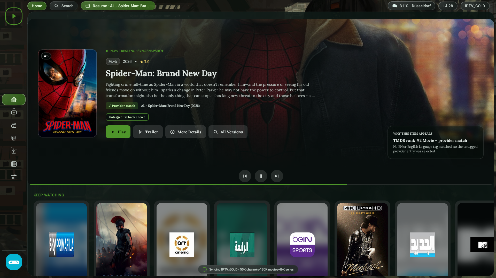

<p align="center">
  
</p>

<p align="center">
  <b>High-Performance Native Android TV & Fire TV IPTV Player</b><br>
  <sub>Optimized for Amazon Fire TV Stick 4K (Fire OS 6 / Android API 25) through modern Android 14+ (API 34)</sub>
</p>

<p align="center">
  
  
  
  
  
  
  
  
</p>

---

## ⚡ Direct Download & Installation (Fire TV / Android TV)

The latest release APK is compiled and packaged automatically by **GitHub Actions** on every push.

### Option A: Install via Fire TV "Downloader" App (Recommended)
1. Open the **Downloader** app on your Fire TV or Android TV device (available free in the Amazon Appstore / Google Play).
2. Enter the direct download URL in the URL bar:
   ```
   https://github.com/sagi-madhav/OwnTV/releases/latest/download/OwnTV.apk
   ```
   *(Or enter your custom 5-digit shortcode created on [go.aftvnews.com](https://go.aftvnews.com)).*
3. Click **Go** — the APK will download and prompt you to install immediately.

### Option B: Sideload via ADB (Over Wi-Fi or USB)
```bash
# Connect to your Fire TV or Android TV
adb connect <YOUR_DEVICE_IP>:5555

# Stream install the APK
adb install -r app-standard-debug.apk

# Launch OwnTV
adb shell monkey -p tv.own.owntv -c android.intent.category.LEANBACK_LAUNCHER 1
```

---

## 📖 Architecture & Engineering Documentation

For hiring managers, engineering interview prep, and technical deep-dives:

* 📘 [**APP_ARCHITECTURE_AND_BUILD_EXPLAINER.md**](APP_ARCHITECTURE_AND_BUILD_EXPLAINER.md): End-to-end architecture breakdown, data and ingestion layer, composite build orchestration, CI/CD pipeline, and high-yield interview Q&A.
* 📕 [**INTERVIEW_DEEP_DIVE.md**](INTERVIEW_DEEP_DIVE.md): Technical deep-dive on backporting to API 25, Dalvik/ART Class Verification Isolation, true native 4K display switching, low-RAM (1.5 GB) optimization, and STAR-format interview answers.

---

## 🚀 Key Engineering Highlights

### 1. True Native 4K UHD Playback & Display Mode Switching
Unlike players that force 4K video through a 1080p UI canvas resulting in blurry pictures, OwnTV implements a 3-tier native 4K pipeline:
* **Hardware Overlay Plane (`SurfaceHolder.setFixedSize`)**: Allocates a true 3840×2160 hardware composer surface behind the Compose UI, eliminating downscaling by `MediaCodec` or `libmpv`.
* **Dynamic HDMI Display Mode Switching (AFR)**: `FrameRateController` detects 4K stream dimensions and requests 4K UHD modes (`preferredDisplayModeId`) via `DisplayManager`, switching physical HDMI output to native 4K (`3840x2160@30Hz/25Hz`).
* **Unconstrained Media3 Viewport**: Clears default 1080p viewport ceilings in `DefaultTrackSelector`, allowing unhindered selection of 4K HLS variants.
* **In-Player Quality Selector**: Easily switch between "Auto (Best)" and manual resolution variants directly from the HUD.

### 2. Dual Playback Engine Architecture
* **Media3 ExoPlayer**: Powers the low-latency channel guide hover preview and standard HLS/DASH live streams.
* **libmpv (FFmpeg)**: Handles raw satellite MPEG-TS feeds, interlaced video (1080i), custom HTTP headers, and advanced audio codecs (AC3, E-AC3, TrueHD).
* **Decoder Watchdog**: Continuously monitors frame delivery timestamps. If a stream stalls or corrupts, it automatically flushes demuxer buffers or switches engines with zero UI lockup.

### 3. Backported to Android API 25 (Fire OS 6)
* **Class Verification Isolation**: Completely avoids Dalvik/ART `NoSuchMethodError` crashes on Android 7.1 by isolating API 26+ methods (e.g. `PixelCopy.request(Surface, ...)`) into `@RequiresApi(O)` helper objects that ART never verifies on legacy OS versions.
* **Java 8+ Desugaring**: Uses Google's L8 desugaring compiler (`desugar_jdk_libs`) to run modern Java APIs (`java.time.*`, `java.util.concurrent.*`) seamlessly on Android 7.1.
* **D-Pad & Remote Focus Hierarchy**: Deterministic fallback focus restorers (`.focusRestorer(sidebarFocus)`) prevent focus loss and remote freezes on TV remotes.

### 4. Memory Optimization for Low-RAM Devices (1.5 GB RAM)
* **Streaming M3U & XMLTV Parsers**: Uses `PushbackInputStream` and `XmlPullParser` to stream playlists with 50,000+ channels and multi-gigabyte EPGs directly into Room SQLite transactions in 500-item chunks without heap spikes.
* **Database Page Caching**: Configured Room SQLite in WAL mode with an 8 MB capped memory budget (`PRAGMA cache_size = -8000`) and `android:largeHeap="true"`.

---

## ⚙️ Recommended Player Settings (Fire TV Stick 4K)

To get the absolute best picture and performance out of your Fire TV Stick 4K:

| Setting | Setting Location | Value | Why |
| :--- | :--- | :--- | :--- |
| **Hardware Decoding** | Settings → Video Player | **ON** *(Mandatory)* | Offloads decoding to the MediaTek VPU; prevents 100% CPU lockup and thermal throttling. |
| **Auto Frame Rate (AFR)** | Settings → Video Player | **ON** *(Recommended)* | Matches TV refresh rate (24/25/50/60 Hz) to stream FPS; eliminates motion judder in sports. |
| **Deinterlacing** | Settings → Video Player | **AUTO** *(Recommended)* | Weaves alternating fields on 1080i cable/sports channels into smooth progressive video. |
| **Video Quality** | Player HUD (Gear / Video Icon) | **Auto (Best)** | Automatically locks onto the highest 4K bitrate variant available. |

---

## 📸 Screenshots

<p align="center">
  
  
</p>
<p align="center">
  
  
</p>

---

## 🛠️ Building From Source

OwnTV is structured as a **Gradle Composite Build**, bringing together `OwnTV-main` (the application and UI layer) and `OwnTV_Core` (the playback, networking, and database engine).

### Prerequisites
* JDK 17 or JDK 21
* Android SDK 34 (`platforms;android-34`, `build-tools;34.0.0`)

### Build Commands
```bash
# Clone the repository with submodules
git clone https://github.com/sagi-madhav/OwnTV.git
cd OwnTV

# Build the standard debug APK using the composite build
cd OwnTV-main
./gradlew assembleStandardDebug

# Output APK path:
# OwnTV-main/app/build/outputs/apk/standard/debug/app-standard-debug.apk
```

---

## 📱 Hardware Compatibility Matrix

| Hardware Model | OS Version | API Level | RAM | Status |
| :--- | :--- | :--- | :--- | :--- |
| **Amazon Fire TV Stick 4K (1st Gen, 2018)** (`AFTMM`) | Fire OS 6.7.x | **API 25** | 1.5 GB | ✅ **Verified & Tested Live** |
| **Amazon Fire TV Stick 4K Max (1st Gen, 2021)** (`AFTKA`) | Fire OS 7.6.x | API 28 | 2.0 GB | ✅ Supported |
| **Amazon Fire TV Stick 4K Max (2nd Gen, 2023)** (`AFTKRT`)| Fire OS 8.1.x | API 30 | 2.0 GB | ✅ Supported |
| **Chromecast with Google TV (4K)** | Android TV 12 | API 31 | 2.0 GB | ✅ Supported |
| **Nvidia Shield TV / Pro** | Android TV 11 | API 30 | 3.0 GB | ✅ Supported |
| **Generic Android TV / Google TV** | Android 7.1 – 14+ | API 25–34 | 1.5 GB+ | ✅ Supported |

---

## ⚖️ Legal Disclaimer

OwnTV is strictly a **media player application**. It does **not** provide, host, distribute, or bundle any content, playlists, streams, or channels. Users must supply their own legally obtained streams or subscriptions (M3U, Xtream Codes, or Stalker portal).

---

## 📄 License

This project is licensed under the terms of the **GNU General Public License v3.0 (GPL-3.0)**.
